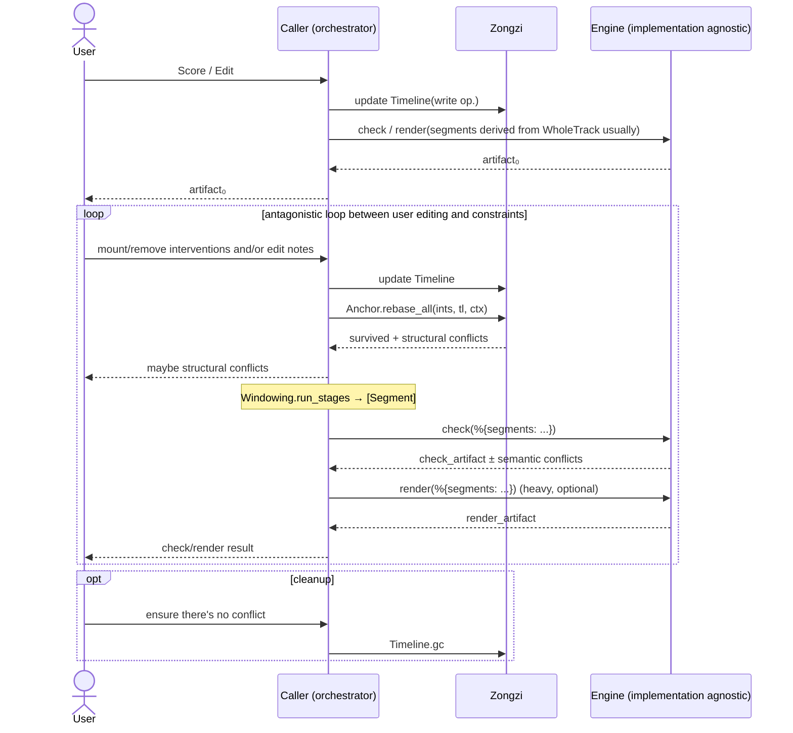

# 粽子 (Zongzi)

> **Branch Intro**
>
> This branch `docs/research-zongzi` is only used for understanding the project, as it is a product of Vibe Coding based on a series of LLMs under a very abstract idea,
> and the relationships between the various components need to be thoroughly analyzed & digest.
>
> This branch only allows for documentation modifications and additions; it will not modify existing code.

Zongzi is:

1. Providing functional components and specifications for building SVS(Singing Voice Synthesis) editors
2. Providing unified adaptation for different SVS processing components in the BEAM ecosystem

i.e. it's [plug](https://hex.pm/packages/plug) without server in SVS.

## Core Architecture



## Documents(Chinese)

- `docs/zh/spec/MENTAL_MODELS.md` — 分层与角色
- `docs/zh/spec/decisions/` — 设计决策（无编号）
- `docs/zh/spec/GOLDEN_SCENARIOS.md` — 场景约束（骨架；用例随实现补）

## Install

```elixir
def deps do
  [{:zongzi, github: "SynapticStrings/Zongzi", branch: "main"}]
end
```

## ROADMAP

- [ ] Consolidate protocol
    - See <https://github.com/GES233/zongzi_feasibiliity>
- [ ] Organize documents and use cases 👈 *We're here* 
- [ ] Translate document into English
- [ ] Publish to hex.pm
