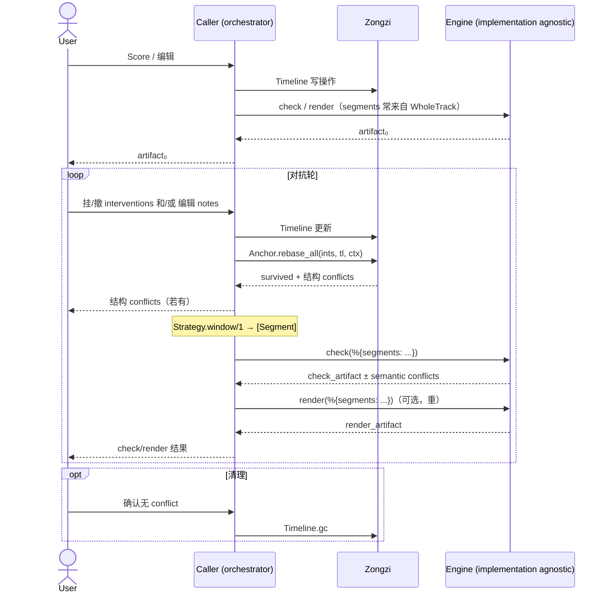

# 粽子 (Zongzi)

Zongzi 是：

1. 提供构建 SVS 编辑器的函数式组件与规范
2. 为 BEAM 生态的不同 SVS 处理组件提供统一适配

换言之，就是 SVS 领域的 plug without server。

## 边界：核内 vs 库外

| 在 zongzi 内 | 不在 zongzi 内（Caller / 引擎 / 编辑器） |
|---|---|
| Score 基础（Note / Tempo / TimeSig / Grid） | Caller 编排：edit batch → 组 Context → 调引擎 |
| Timeline 写路径 + Query 读原语 | 用户曲线绘制、重叠合成、清除工具（编辑器操作面） |
| Anchor 结构 rebase（`rebase_all` / Strategy） | Declaration 的具体 channel 实现（接模型后再落） |
| Intervention 数据形状 + Declaration **契约** | Engine 真实现、artifact 形状、引擎错误细节 |
| Engine **契约**（`check` / 可选 `render`，只吃 `[Segment]`） | 编辑器操作面、phrase 缓存实现 |
| Windowing **契约**（`Strategy.window/1` → `[Segment]`） | 邻片 pad 归属/缓存（Caller/引擎） |
| Slicer（note-only 旧工具） | cross-channel invalidation 策略 |

**Caller** 不是 zongzi 模块，而是**任意**库外编排者（编辑器 Session、测试 harness、CLI…）。  
它持有 Note 表，在 edit 后组装 `Anchor.Context`，调用 `Anchor.rebase_all/4`，再按 Engine 契约做 check / render。

## 核心架构



### 引擎契约：behaviour，不是 pipeline

zongzi 不跑渲染——只定义引擎必须遵守的 `@callback`。内部实现可以是复杂 DAG、
pipeline 或任意结构，zongzi 不关心。

### 多轮对抗式循环

```
render → interventions 挂/撤销 →（编辑后结构 rebase）→ render → ...
```

一次完整渲染 = N 轮。每轮引擎产出 Artifact，用户挂/撤 intervention，
下一轮 render 消费新的干预状态。没有独立的 resolve 或 adapt 步骤——
它们只是 intervention 的增删 + 引擎内 Declaration 回调。

## 心智模型（摘要）

更完整的叙述见 `docs/zh/spec/MENTAL_MODELS.md`。

### 序列真相：Timeline + SeqID

借鉴 Sequence CRDT（RGA 系），剃掉分布式共识部分：

- **SeqID** — 永久位置标识。由 Timeline 自持 counter 生成（非全局 `unique_integer`），
  跨会话序列化安全。音符 split/merge/drag 后 SeqID 不变，
  Intervention 锚在 SeqID 上而非 Note.id。
- **note_order** — SeqID 的显式有序链表，是轨道的 ground truth
- **tombstones** — 被 merge 或 delete 的音符 SeqID 保留在链表中（墓碑），维护邻接稳定性。
  区分 merge 墓碑（seq_map 保留条目）和 delete 墓碑（seq_map 已移除）
- **Query 原语**（`Timeline.Query`）— `status/2`、`scan/4`、`neighborhood/3`、
  `scrub_triplet/2`、`hops/3`。策略层只依赖这些读 API。
- **gc/2** — 手动回收无 intervention 引用的墓碑

> 旧 API 名 `adjacent/2`、`try_match/2`、`nearest_active/3` 已删除；
> 语义分别由 `neighborhood` / 策略内 2-of-3 / `scan(active_only: true)` 承担。

### 干预锚定：NoteTriplet + 2-of-3 exact match

默认策略 `Anchor.NoteTriplet`：Intervention 锚在 `{prev_seq, current_seq, next_seq}`。
Timeline 变更后，`rebase/3` 用 **exact match**（非 fuzzy）决定存活：

| current 状态 / 邻接匹配 | rebase 决策 |
|---|---|
| active + 3/3 | `{:ok, :preserve}` |
| active + 2/3 | `{:ok, {:rebase, updated}}`（刷新邻居） |
| active + 0–1/3 | `{:conflict, :adjacency_lost}` |
| merge tombstone | `{:conflict, :merged_away}` |
| delete / missing | `{:ok, {:relocate, updated, meta}}` 或 conflict（沿方向 / 打分选新宿主） |

更精细的选宿主见 `Anchor.ScoredHost`（同 key / 同窗打分；跨窗 forbid）。

方向（`Context.orphan_direction`）由调用方按 channel 注入——
pitch 曲线尾巴常往 `:prev`，phoneme timing 常往 `:next`。各论各的。

### Intervention 载荷心智

| 通道形态 | payload 形状 | 锚 | conflict detect |
|---|---|---|---|
| 曲线参数（pitch 等） | 控制点 + 边界 + **原始值**（进 snapshot） | Seq 三元组等 | snapshot 原始值 vs 新投影 |
| timing | 边界 / 偏移 + 原始值 | 同上 | 同上 |
| G2P / 音素结果等 | 挂在 note 或 note 序列上 | note / 序列 | 另一类 payload |

曲线的**用户操作面**（手绘、重叠合成、部分清除）不在 zongzi 核内；
核只关心挂上 Timeline 之后的结构存活与语义契约。

### Intervention 生命周期

**结构层**（zongzi 内，编辑后）：

1. 挂载 — 创建 `Intervention`，记录 anchor、payload（delta）、snapshot（原始值）
2. 编辑 — notes split/drag/merge/delete 后，`Anchor.rebase_all` 判结构存活
3. 回收 — 用户确认无 conflict 后，手动 `Timeline.gc` 清理未引用墓碑

**语义层**（引擎侧，`Intervention.Declaration` behaviour；**具体实现后置接模型**）：

- `scope/2` — 切窗前，静态可算的保守上界
- `snapshot/2` — 挂载时从投影提取原始值
- `resolve/2` — 渲染时比对 snapshot，apply delta 或 conflict

结构策略字段：`Intervention.strategy`（`Anchor.Strategy` 模块，默认 `NoteTriplet`）。
与 Declaration（语义）正交，不要混。

## 文档

- `docs/zh/spec/MENTAL_MODELS.md` — 分层与角色
- `docs/zh/spec/decisions/` — 设计决策（无编号）
- `docs/zh/spec/GOLDEN_SCENARIOS.md` — 场景约束（骨架；用例随实现补）

## 安装

```elixir
def deps do
  [{:zongzi, github: "SynapticStrings/Zongzi", branch: "main"}]
end
```

## ROADMAP

- [ ] Review `Zongzi.Timeline`
    - [ ] 重写文档
    - [ ] 100% Coverage
- [ ] Review `Zongzi.Anchor`
- [ ] Review `Zongzi.Intervention`
