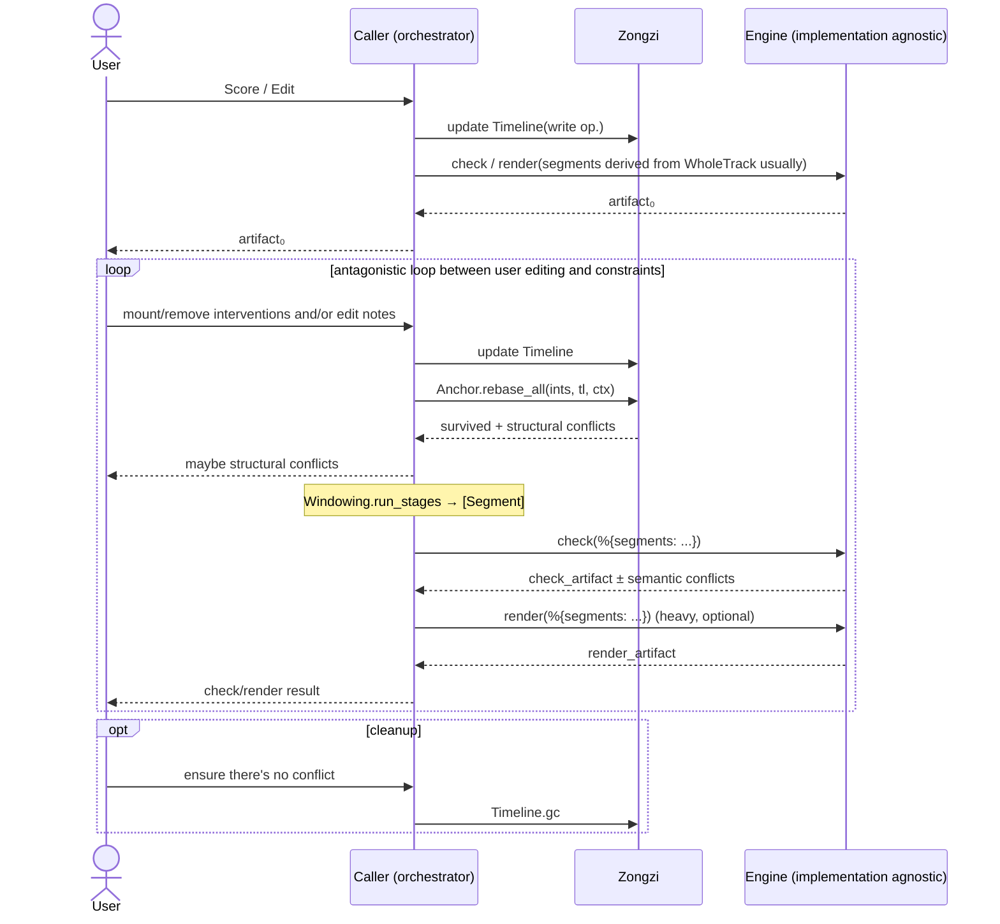

# Zongzi

Zongzi is:

1. Providing functional components and specifications for building SVS(Singing Voice Synthesis) editors
2. Providing unified adaptation for different SVS processing components in the BEAM ecosystem

i.e. it's [plug](https://hex.pm/packages/plug) without server in SVS.

## Core Architecture



## Documents

TODO

## Install

```elixir
def deps do
  [{:zongzi, github: "SynapticStrings/Zongzi", branch: "main"}]
end
```
