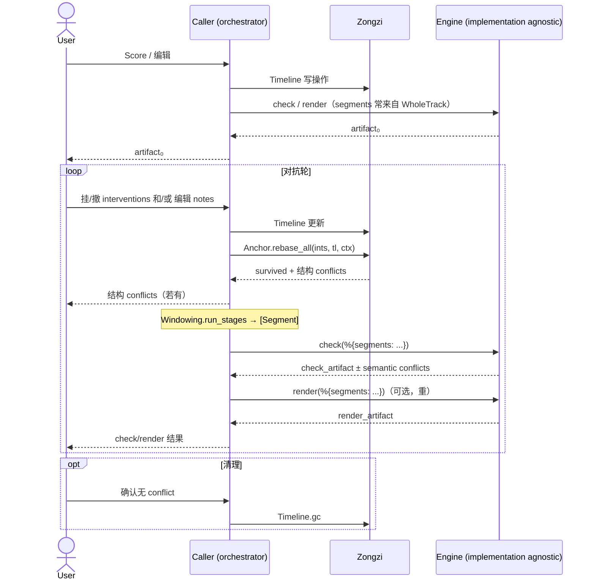

# 粽子

[English](./README.md) | [简体中文](./README.zh-CN.md)

Zongzi 是：

1. 提供构建 SVS 编辑器的函数式组件与规范
2. 为 BEAM 生态的不同 SVS 处理组件提供统一适配

换言之，就是 SVS 领域的 plug without server。

## 核心架构



## 文档

等我写完。

## 安装

```elixir
def deps do
  [{:zongzi, github: "SynapticStrings/Zongzi", branch: "main"}]
end
```

# ROADMAP

## 编码

- [ ] Timeline 对象的边界条件
    - 合并后消失的音符被删除（批量删除或什么的）挂载在其上的 interv 怎么处理
- [ ] 内核的序列化（Note Key Timeline Intervention）
- 工程卫生类
    - 错误信息的分类 -> 每个模块自己负责吧，还用不上 Exception
    - Telemetry
    - Dialyzer
    - Hex package
- 收束分窗和引擎到底时什么？`notes_for_seq` ？ `notes_by_seq` ？ `notes` ？
    - 分清 Context 或 Engine
- 把 Anchor 的 context 升级下？把常用字段固化进去？

## 文档

- 确定 glossary
    - 多语言的词典
