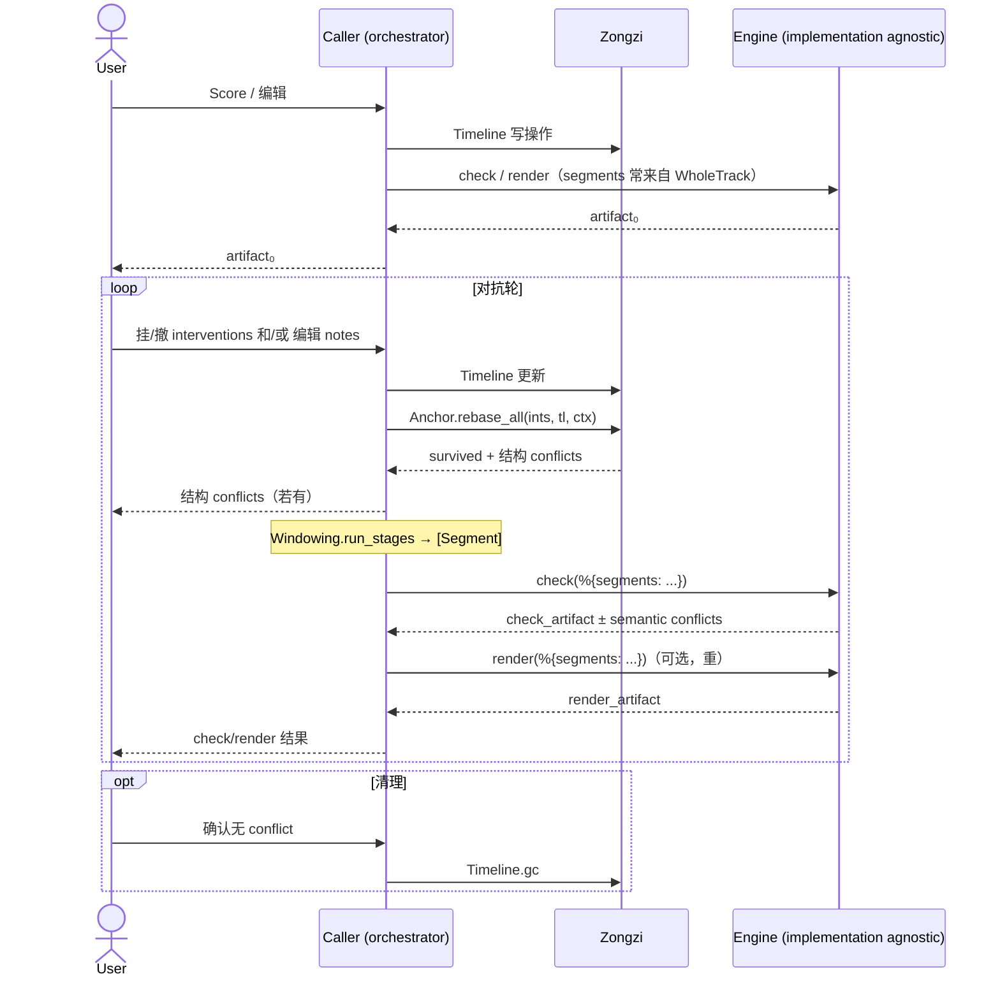

# 粽子

 

[English](./README.md) | [简体中文](./README.zh-CN.md)

Zongzi 是：

1. 提供构建 SVS 编辑器的函数式组件与规范
2. 为 BEAM 生态的不同 SVS 处理组件提供统一适配

换言之，就是 SVS 领域的 plug without server。

## 核心架构



## 文档

等我写完。

## 安装

```elixir
def deps do
  [{:zongzi, github: "SynapticStrings/Zongzi", branch: "main"}]
end
```
