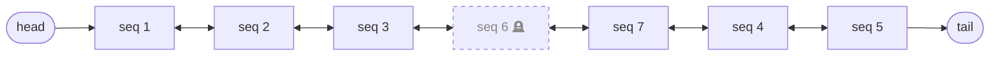
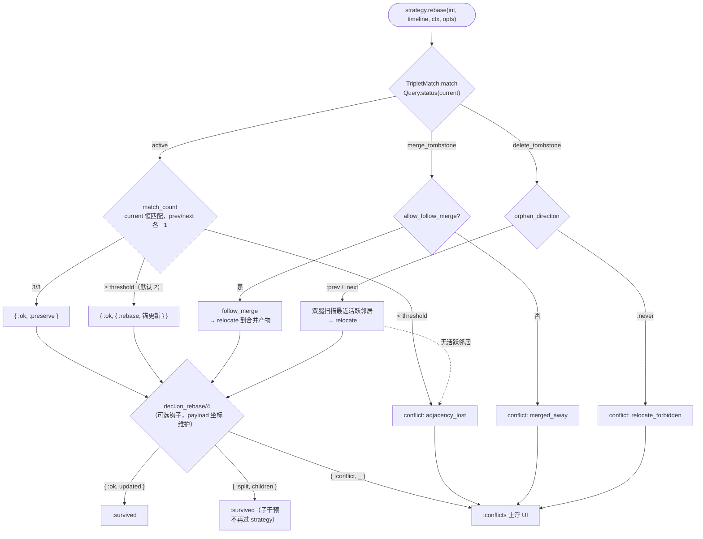
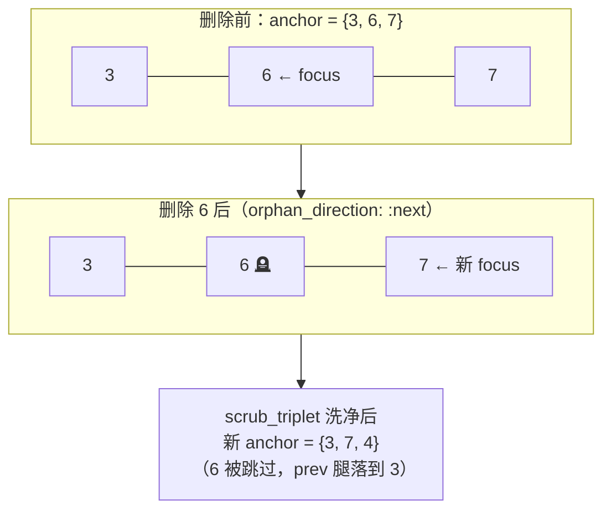
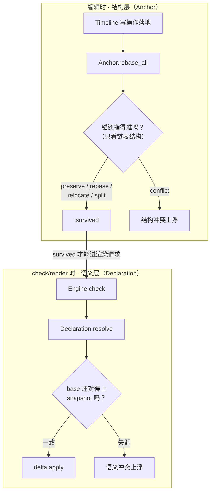
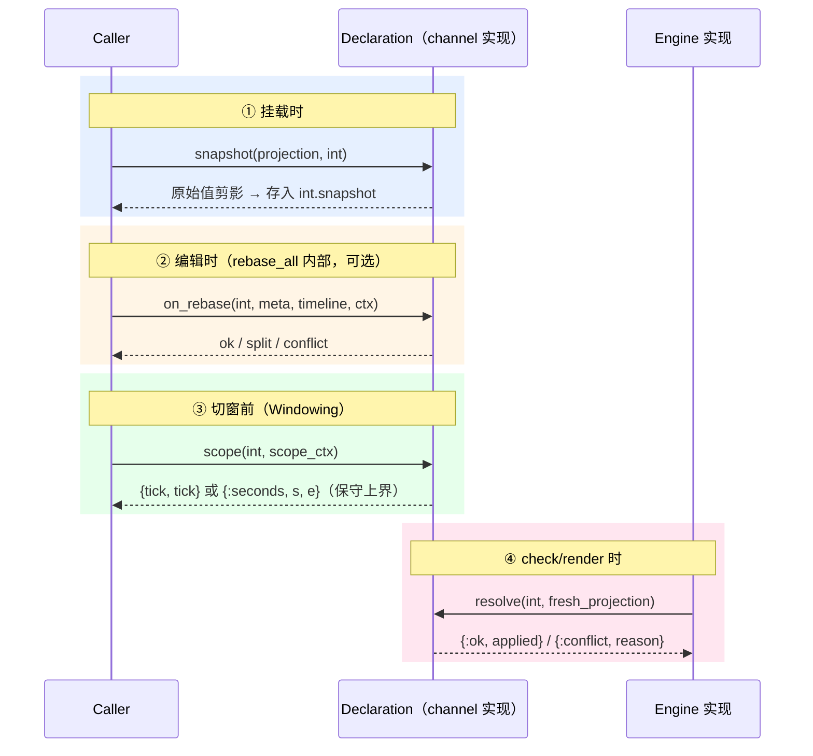

# The Little Zongzi

受 *The Reasoned Schemer* 影响的基于问答的文档，希望大家可以通过问答快速了解这个三四千行的小库。

## Phase 0 —— 是什么

> *Q0. 这个库想解决什么问题？它给谁用的？*

A. zongzi 是一个应用于 SVS 应用的内核/接口，其针对调教过程中音符变化后（拖拽等）调教参数静默失效的情况而被设计，旨在将失效行为暴露给用户让其定夺。

> *Q1. 除了这个仓库还有什么？*

A. 可以看 <https://github.com/GES233/zongzi_feasibiliity> ，以及后续梳理完成后重构的代码以及帮助文档。

## Phase 1：数据层 —— 存了什么

涉及的模块：

- `Zongzi.Score.Note`
- `Zongzi.Score.Key`
- `Zongzi.Timeline`

> *Q0. 方便介绍一些存了些什么吗？*

A.

主要是音符以及音高的领域模型（`Zongzi.Score`），逻辑相对简单，并不需要在这里展开，除此之外还有维护邻近音符序列的 `Zongzi.Timeline` 。

对于将要引入的 Timeline 模块而言，初次阅读可能显得过于抽象，可以先跳到下一阶段再回看。

> *Q1. Timeline 存的是什么？一个 note 有哪些字段？*

A. 

先回答第一个问题，`Zongzi.Timeline` 的数据结构是将轨道上音符之间的邻接关系显式建模所设立，其需求是在注入拖拽音符到新位置的这类情况以及需要用到邻近音符之间的关系。

按照代码，如下：

```elixir
defmodule Zongzi.Timeline do
  ...
  @type t :: %__MODULE__{
          track_id: ID.t(),
          head: SeqID.t() | nil,
          tail: SeqID.t() | nil,
          nodes: %{SeqID.t() => {SeqID.t() | nil, SeqID.t() | nil}},
          seq_map: %{SeqID.t() => ID.t(Note)},
          tombstones: MapSet.t(SeqID.t()),
          next_seq: pos_integer()
        }
  defstruct [
    :track_id,
    head: nil,
    tail: nil,
    nodes: %{},
    seq_map: %{},
    tombstones: MapSet.new(),
    next_seq: 1
  ]
end
```

下面简单介绍下字段：

* `:track_id` - 轨道的 ID ，用于下游应用的身份标识 *（其实可选）*
* `:head` 以及 `:tail` - 两端的音符的 SeqID
* `:nodes` - 记录音符邻接表的字段
* `:seq_map` - SeqID 到目前存活 NoteID （以及被合并的 NoteID）的映射
* `:tombstones` - 记录哪些被删除或被合并的 SeqID
    * 区分的方法就是看 `:seq_map` 中存不存在
* `:next_seq` - 用于维护将要被生成的新 SeqID 的计数器

而 note 主要用于记录音符本身。

```elixir
defmodule Zongzi.Score.Note do
  use Model,
    keys: [
      :id,              # 记录音符的 ID
      :start_tick,      # 记录音符的开始时刻
      :duration_tick,   # 记录音符的时长
      :key,             # 音高
      :lyric,           # 歌词
      seq_id: nil,      # SeqID
      annotation: nil,  # 面向用户/UI的标注
      metadata: %{}     # 元数据
    ],
    id_prefix: "Note_"
end
```

> *Q2. SeqID 是什么，谁分配它？*

A. 是一组独立于音符ID的序列ID，其本质上是正整数。
和音符最大的不同是当某个轨道的音符消失了（因为被删除或被合并），该ID依旧存在，且不允许被修改。
分配 SeqID 的模块是 `Zongzi.Timeline` 。

> *Q3. Timeline 是双向链表还是别的数据结构？怎么遍历？*

A.

以前是列表，现在由于性能要求是基于字典的邻接表以及表示两端的字段。

形如：

```elixir
%{
  head: seq_id | nil,
  tail: seq_id | nil,
  nodes: %{seq_id => {prev_seq_id | nil, next_seq_id | nil}}
}
```

我们假设某个 Timeline 完成了一系列操作（创建、创建、创建、创建、创建、在 SeqID 为 4 前的地方插入、在 SeqID 为 4 前的地方插入、删除 SeqID 为 6 的音符）。


其结构为：

```elixir
%{
  head: 1,
  tail: 5,
  nodes: %{
    1 => {nil, 2},
    2 => {1, 3},
    3 => {2, 6},
    4 => {7, 5},
    5 => {4, nil},
    6 => {3, 7},
    7 => {6, 4}
  },
}
```

我们不需要在意删除的音符。

如果想要遍历所有的音符，最好先从 `:head` 开始（一般是 $1$ ），我们得知了 `Timeline` 从 $1$ 开始，之后从 `:nodes` 中取 $1$ 对应的邻接关系，得知没有前一项并且后一项是 $2$ ，因此我们知道 $1$ 的后面是 $2$ ，以此类推。

因为我设计了插入音符，整个列表并不按照自然数列递增（当然，就 SeqID 的生成而言，一定是单调递增的）。可以发现 $3$ 的后面是 $6$ ， $6$ 的后面是 $7$ ， $7$ 又回到 $4$ 了。

其结构为：



> *Q4. 如果我改一个 note 的歌词，Timeline 本身会变吗？*

A. 

并不会。

Timeline 只维护音符序列的关系（谁前谁后），修改音符歌词、时长等并不会修改 Timeline 。

同时也不难得出，如果存在同时刻音符，prev/next 退化为任意序（插入先后），失去了时间语义。
我们建议一个 Timeline 仅有一条音符序列，和弦/同时刻音符应由多条 Timeline 承载。

> **注意**
>
> Timeline 并不是轨道！

## Phase 2：介入数据 —— 用户怎么盖掉模型生成

涉及的模块：

- `Zongzi.Intervention`

要回答的问题：

> *Q0. 为什么叫 Intervention （下文用 Interv 简写代替）？什么才算做 Interv ？*

A.

在这里简单介绍下。

Intervention 的本意是「干预」，在这里，就是创作者认为模型生成的并不能够很好的表达其想法，因此对模型输出做出的修改。

我们可以发现，其存在如下的约束：

* 这个参数的原始输出是模型而不是人类
    * 音符的音高于歌词不是 Interv
    * 速度变化不是 Interv
* 这个参数是可以被人类理解以及修改的
    * Interv 需要工具来「介入」数据流
    * 无法根据手绘的方式来修改梅尔谱或波形（我没把话说死）
    * 音素时长应该在时间轴上被拖拽而不是曲线
* 修改的有效与否也跟着原始输出的变化而变化
    * **修改的调教是针对旧数据的，无法确保数据更新后调教使得否有效**

这也是开发 zongzi 的主要原因。

> *Q1. Interv 绑在哪个 note 上？（anchor 三元组是什么）*

A. 

从以上的定义我们可以得到这里的 Interv 和音符的耦合很大。

但是一个音符所对应的 Interv 真的和音符一一对应吗？

从 preutterance 以及某参数可能在音符末留下超出音符范围的尾巴两个场景开始。
当然也包括数据在跨语言 FFI 时所产生的估算偏差。
经过了一系列的思考，我们选择了一个有些原始的策略：

一个音符产生结构变化（Timeline 的变化）以及部分的语义变化，就会「污染」到临近的音符。

所以三元组就是此刻给定音符的前一个、它本身，以及下一个音符的标识符（其实是 SeqID 组成的，要是没有那就 nil 了），调教痕迹依附在这「前一个音—这个音—后一个音」的邻里关系上。
这个策略其实相当保守，是一种「宁肯错杀，绝不放过」的思路，因为误判的代价也就是下游引擎/外部调用者/用户要多梳理些相关逻辑罢了。

> *Q2. payload 里存什么？*

A. `:payload` 里存着的，就是源于用户的 Interv 数据本身。

暂时并没有明确的构想，但是按照往常的构思，大抵可以分成两类：

* 离散的分类数据（类比于 textGrid）
* 某一维度内的连续数据（也适用于高维，但那种情况太极端了，也就是参数曲线）

> *Q3. snapshot 是什么时候拍的？为什么要拍？*

A. 这是对原始输出数据的一个快照或剪影。snapshot 对得上，interv 就有效。
虽然 interv 和音符不是一一对应的，但和 snapshot 是对应的。

（其实我本来的想法是写进 payload 里边，这个是 LLM Vibe 出来的，比我的原始想法要好，而且也可以处理注入拖拽导致数据漂移但保留调教的极端情景）

> *Q4. scope 是什么作用的？*

A. 简单说就是 interv 的范围，是否可能「污染」到前面或后面的音符。

> *Q5. strategy 字段是干嘛的？*

A. 那就是针对这个 interv 执行锚定所要走的策略和参数了。值是一个 `{module(), options}` 元组，例如 `{NoteTriplet, %NoteTriplet.Options{match_threshold: 1}}`。`nil` 时 dispatch 用默认策略（`NoteTriplet` + 默认参数）。

## Phase 3：锚定、同步与变基 —— 操作之后

涉及的模块：

- `Zongzi.Anchor`
- `Zongzi.Anchor.*`

*这是最难的一步，但也是整个库的灵魂。慢读。*

要回答的问题：

> *Q1. rebase_all 输入什么输出什么？*

A.

输入四项：

- `interventions` — 需要 rebase 的列表（可以为空）
- `timeline` — 编辑后的 Timeline（nodes/tombstones/seq_map 已落地）
- `context` — Caller 注入的只读快照（`notes_by_seq` 等；不传时用空 Context）
- `opts` — `:default_strategy`（不指定时默认 `NoteTriplet`）

输出 map 三个键：

- `:survived` — 结构存活的 intervention 列表（含 on_rebase split 出的子干预）
- `:conflicts` — `{intervention, reason}` 列表，上浮给 UI
- `:decisions` — 每条 intervention 的结构决策（`:preserve/:rebase/:relocate/:split/:conflict`）

> *Q2. "结构层冲突"是指什么？（preserve / rebase / relocate / split / conflict 各是什么场景）*

A.

结构性冲突就是由于音符序列本身产生变化所带来的干预数据的冲突。

可以看一下 `t:Zongzi.Anchor.decision_label` 的声明，其包括了以下几类：

- `:preserve` - 三元组完全无损（3/3 match），原样存活
- `:rebase` - focus 音符还在，但 prev/next 变了（≥ threshold match），锚更新
- `:relocate` - focus 已死（被删/被合并），重新挂到最近的活跃邻居上
- `:split` - `on_rebase/4` 返回子 intervention 列表，每个子干预不再走 strategy
- `:conflict` - 结构无法存活，原因包括 `:adjacency_lost`（邻接丢失）、`:merged_away`（被合并消化）等

其是 `strategy.rebase/4` 经过可选的 `decl.on_rebase/4` 两步处理返回的结果。



> *Q3. split note 时，挂在原 note 上的 Intervention 怎么处理？*

A. 按照我本来的想法是附近的都无效掉，但对于部分 interv 不用全部 discard 掉。所以可以交给 declara 的可选 callback `on_rebase/4` 来实现。

> *Q4. delete note 时，Intervention 怎么可能 relocate？*

A.

我们回到 phase1 的那个例子吧。
删掉的 $6$ 号音符可能挂着两边音符的 Interv 的尾巴。

所以在其上的 Interv 有可能和临近的活跃音符有关。

在 rebase 时，就会根据上下文的声明来进行向两边合并的尝试，但是也引入了直接 conflict 的选项。



> *Q5. rebase_all 里面走了哪两步？和渲染时的 resolve 怎么分界？*

A.

内部两步（都是纯结构判定，不碰 snapshot）：

1. `strategy.rebase/4` — 看锚还指得准不准
   - 音符活着 → preserve / rebase / adjacency_lost
   - 音符死了 → relocate / merged_away

2. `decl.on_rebase/4`（可选钩子）— 做 payload 的坐标维护
   - `{:ok, updated}` → 存活
   - `{:split, children}` → 产出子干预
   - `{:conflict, reason}` → 冲突

和渲染时的区别：
- `rebase_all` — 编辑时判定**结构**存活（锚还指得准吗？）
- `Declaration.resolve` — 渲染时比对 **snapshot** 判定**语义**有效（base 还对得上吗？）

可以查看以下图示：



## Phase 4：分窗与引擎整合

涉及的模块：

- `Zongzi.Windowing`
- `Zongzi.Engine`

要回答的问题：

> *Q1. Windowing 把 Timeline 切成什么给 Engine？为什么要切？*

A. 将整个 Timeline 以及音符序列切成片段，以便于外部应用实现基于乐句的缓存与增量生成等特性，同时出于简化 API 以及兼容，哪怕不需要外部缓存，也会将整轨压缩成一个完整片段。



> *Q2. Engine behaviour 要求实现哪几个函数？输入输出各是什么形状？*

A. 需要一个必选函数 `check/1`，以及一个可选函数 `render/1` ，输入完全一样，是包括诸多对象的字典，输出是外部产出，包括检查解决以及渲染结果。

> *Q3. preutterance / spill 是什么概念？spill 会导致什么冲突？*

A.

preutterance 是由于音符开始于元音开始的阶段，因此实际的发声区间会略早的情况；spill 就是因为各种各样的原因，相比于 note duration span 标注 interv 参数可能会略微溢出的现象。

spill 可能会导致 interv 和临近音符的边界并不会很清晰。

## Phase 5：干预数据的策略声明

涉及的模块：

- `Zongzi.Intervention.Declaration`
- `ZongziFeasibility.Declaration.Pitch` (*in <https://github.com/GES233/zongzi_feasibiliity>*)

要回答的问题：

> *Q1. Declaration behaviour 要求实现哪几个回调？（scope / snapshot / resolve）*

A.

从上文的 preutterance/spill 不难得出一个问题：如果两个音符相距很远，其略微越界的 interv 并不会互相影响，但是在 Timeline 中很容易被污染，怎么办？

这就需要引入一个比较粗线条但是可以马上判断的机制来告诉 zongzi ，这些参数到底会不会相互影响。

那么这就是 `scope/2` 所负责的事情，其接受 interv 本体以及 timeline 对象，来返回最保守的边界。

对于 `snapshot/2` 而言，其在每次挂载时被触发，因为 interv 的挂载原始值是必须对应的。

所以其接受原始值以及 interv ，其结果存入 interv 的 `:snapshot` 。

`resolve/2` 则根据原始值以及 interv 决定是否可用。

---

*以下部分尚未跟进*

2. resolve 什么时候返回 {:ok, applied}，什么时候返回 {:conflict, :snapshot_stale}？
3. snapshot 的归一化做了什么？为什么需要归一化？

## Phase 6：Caller 怎么串起来（编排层）

涉及到模块：

- `ZongziFeasibility.Caller` (*in <https://github.com/GES233/zongzi_feasibiliity>*)

要回答的问题：

1. Caller 持有哪几样东西？
2. edit 函数的完整回路是什么？（写 op → apply → Anchor.rebase → refresh scope → window → report）
3. check_round 和 render_round 的区别？
4. tick↔frame 换算为什么在 Caller 做而不是在 Engine 做？

产出：画一张流程图，从"用户改歌词"开始，到最后拿到 report，中间 Caller 调了哪些 zongzi 模块，每一步的数据形状。

## Phase 7：Golden Scenarios（冒烟测试文档）

TBD

按这个顺序读，每个场景问：

1. setup 造了什么数据？
2. edits 做了哪个操作？
3. expect 断言了什么？如果断言失败，意味着什么保护被破坏了？
